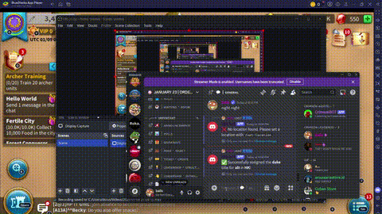

# Discord Title Bot

A **Discord bot** built for **Rise of Kingdoms (RoK)** title management. The bot automates **title assignment**, **location tracking**, and **bot navigation** using **Discord commands, MongoDB persistence, and ADB integration** with an emulator/device.

---

## Features

- **Title Assignment System** → Handles Duke, Scientist, Architect, and Justice titles with cooldowns + queueing.
- **Location Tracking** → Users save in-game coordinates (`/set-location`) for quick targeting.
- **Bot Locator** → Admins run `/locate-bot` to detect bot’s current position using OCR + reference images.
- **Database Persistence** → MongoDB stores user locations and last visited kingdoms.
- **ADB + OCR Integration** → Captures screenshots, processes images with Sharp + Tesseract.js.
- **Permissions Enforcement** → Admin-only commands for sensitive bot controls.

---

## Demo

See the bot in action:

- [](https://youtu.be/qWGF4W2bfXI)
- [](https://youtu.be/NFrKKCJ1rGU)

---

## Impact

**Automates title rotations** → Reduces manual overhead in RoK leadership.  
**Reliable queue system** → Ensures fair title distribution with cooldowns.  
**Stronger guild coordination** → Supports structured role management during wars/events.  
**Cost savings for the kingdom** → Eliminates the need to pay for external title bot services.  
**Career impact** → Led to two paid offers for building similar automation solutions.

---

## Tech Stack

**Core**
- Node.js + Discord.js (command + event system)
- MongoDB + Mongoose (data persistence)
- ADBKit (Android Debug Bridge integration)
- Tesseract.js (OCR engine)
- Sharp + Pixelmatch + PNG.js (image processing)

**Infrastructure**
- `.env` for secrets (BOT_TOKEN, MONGOURL, BOT_ID, HOME_KD, LOST_KD)
- GitHub for version control
- Emulator or USB-connected device for ADB

---

## Repository Structure

```text
discord-title-bot/
├── src/
│   ├── index.js                # Entry point, MongoDB + Discord client setup
│   ├── commands/               # Slash commands
│   │   ├── locateBot.js        # Locate bot’s current position
│   │   ├── setLocation.js      # Save/update user location
│   │   ├── title.js            # Title assignment system w/ queue + cooldown
│   │   └── configureTitles.js  # Placeholder (future use)
│   ├── events/
│   │   └── interactionCreate.js # Event dispatcher for slash commands
│   ├── models/                 # Mongoose schemas
│   │   ├── LastVisited.js      # Tracks last visited kingdom (singleton)
│   │   └── Location.js         # Stores user location + coordinates
│   └── utils/                  # Helpers + automation
│       ├── addTitle.js         # ADB automation for title assignment
│       ├── checkPopUpSide.js   # Reference image recognition + clicks
│       ├── loadEvents.js       # Dynamic event loader
│       └── registerCommands.js # Command registration w/ Discord API
│
├── images/                     # Bot + reference images for OCR/matching
│   ├── botImages/              # Screenshots captured by bot
│   └── referenceImages/        # UI reference elements (crown, popups)
│
├── .env                        # Environment variables (not committed)
├── package.json
└── README.md
```

---

## Additional Documentation

- [ARCHITECTURE.md](./docs/ARCHITECTURE.md) → Event-driven design, command queueing, ADB flow
- [INTEGRATIONS.md](./docs/INTEGRATIONS.md) → Discord.js, MongoDB, ADB, OCR
- [SECURITY.md](./docs/SECURITY.md) → Permissions, token handling, ADB security

---
