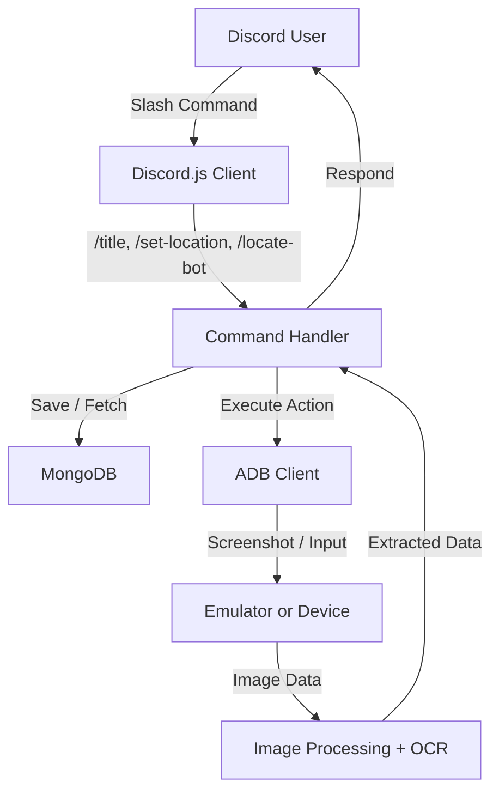

# Discord Title Bot - System Architecture

## 🎯 Purpose

The Discord Title Bot was built to **automate title management and location tracking** for leadership teams in **Rise of Kingdoms (RoK)**. It enables:

- Automated title assignment (Duke, Scientist, Architect, Justice)
- Location tracking for players via coordinates
- Bot self-location detection using OCR + image recognition
- Reliable persistence of player data with MongoDB
- Secure command execution via Discord slash commands

---

## 🛠 Core Architecture Overview

The system is designed as a **modular Node.js application** integrating Discord, MongoDB, ADB (Android Debug Bridge), and OCR libraries.

### 🔹 Discord Layer (discord.js)
- Slash command interface (`/title`, `/set-location`, `/locate-bot`)
- Event-driven system (`interactionCreate` event dispatcher)
- Permissions enforcement (Admin-only commands)

### 🔹 Database Layer (MongoDB + Mongoose)
- `Location` model → Stores player accounts, tiers, and coordinates
- `LastVisited` model → Tracks the last kingdom visited (singleton document)
- Persistence of data across sessions and devices

### 🔹 Device Layer (ADBKit)
- Communicates with an emulator or Android device
- Executes taps, text inputs, and screenshots via ADB
- Used for navigating the RoK UI and performing title assignments

### 🔹 Image Processing & OCR
- **Sharp** → Image cropping and processing
- **Pixelmatch + PNG.js** → Image comparison for reference UI elements
- **Tesseract.js** → OCR engine to extract in-game coordinates from screenshots

---

## 🔗 System Data Flow

---

## 🧩 Subsystem Breakdown

| Subsystem       | Implementation             | Purpose |
|-----------------|---------------------------|---------|
| command_system  | Discord.js (slash commands) | User interaction & permissions enforcement |
| event_system    | Discord.js events          | Dispatches interactions to command handlers |
| database        | MongoDB + Mongoose         | Stores player locations & last visited kingdoms |
| adb_integration | ADBKit                     | Sends taps, captures screenshots from device |
| image_engine    | Sharp, PNG.js, Pixelmatch  | Processes screenshots, detects reference images |
| ocr_engine      | Tesseract.js               | Extracts coordinates from cropped screenshots |

---

## ⚡ Architecture Strengths

- **Automation of repetitive tasks** → Title assignment and location handling without manual effort
- **Resilient queueing system** → Prevents overlapping title assignments with cooldowns
- **Hybrid integration** → Bridges Discord, databases, and Android emulation in one pipeline
- **Scalable design** → Modular separation of commands, events, utils, and models
- **Security-first approach** → Admin-only execution, secrets handled via `.env`