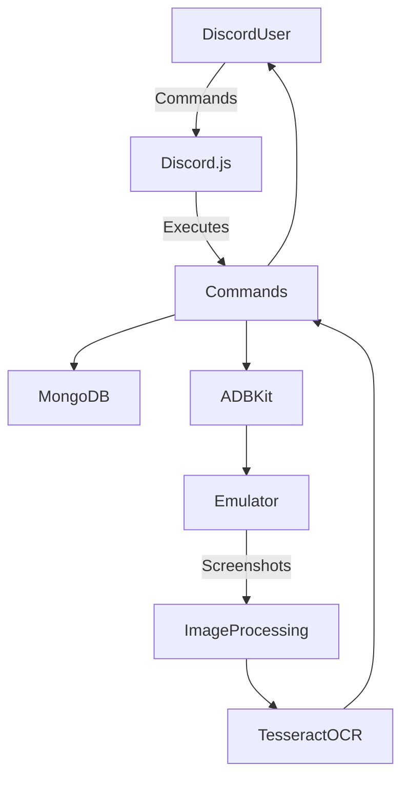

# Discord Title Bot - Integrations Overview

## 🎯 Purpose

The Discord Title Bot integrates with several **third-party libraries and services** to provide automation, persistence, and image-based detection for title management in **Rise of Kingdoms (RoK)**.

---

## 🔑 Discord.js (Command + Event System)

- **Purpose:** Provide slash command interface and event-driven interactions
- **Integration:**
  - Commands: `/title`, `/set-location`, `/locate-bot`
  - Events: `interactionCreate`
- **Features:**
  - Permission enforcement (Admin-only commands)
  - Command queue + cooldown system
- **Risks:**
  - Token (`BOT_TOKEN`) must remain secret
  - Excessive global command registration can hit API limits

---

## 🔑 MongoDB + Mongoose (Database)

- **Purpose:** Store player locations and bot state
- **Integration:**
  - Models: `Location.js`, `LastVisited.js`
  - Connected via `MONGOURL` environment variable
- **Stored Data:**
  - Player account type, tier, and coordinates
  - Last visited kingdom (singleton)
- **Risks:**
  - PII risk if Discord IDs/usernames are exposed
  - Must secure MongoDB connection with authentication

---

## 🔑 ADBKit (Device Control)

- **Purpose:** Automate taps, inputs, and screenshots on emulator/device
- **Integration:**
  - Utility: `addTitle.js` (ADB-driven title assignment)
  - Used in `/title` and `/locate-bot`
- **Features:**
  - Simulated taps + text entry for UI navigation
  - Screenshots for OCR + image recognition
- **Risks:**
  - Device must be secured (avoid uncontrolled remote access)
  - Risk of malformed ADB commands if not validated

---

## 🔑 Tesseract.js (OCR Engine)

- **Purpose:** Extract coordinates and text from in-game screenshots
- **Integration:**
  - Used in `/locate-bot`
  - Processes cropped screenshots for coordinate parsing
- **Features:**
  - Detects text overlays in RoK UI
- **Risks:**
  - OCR accuracy may vary with resolution/quality
  - Sensitive to font and UI changes in-game

---

## 🔑 Sharp + Pixelmatch + PNG.js (Image Processing)

- **Purpose:** Detect in-game UI elements via reference matching
- **Integration:**
  - `checkPopUpSide.js` (reference image detection)
  - `locateBot.js` (cropping + reference bubble detection)
- **Features:**
  - Image cropping, scaling, and comparison
  - Detects buttons/popups before executing actions
- **Risks:**
  - Reference images must be maintained when game UI updates
  - False negatives can break automation flow

---

## 📋 Integration Data Flow

---

## ⚡ Integration Strengths

- Real-world automation using **ADB + OCR**
- **Resilient persistence** via MongoDB
- Modular separation of **command, event, and utility layers**
- Strong Discord integration with permissions + ephemeral replies